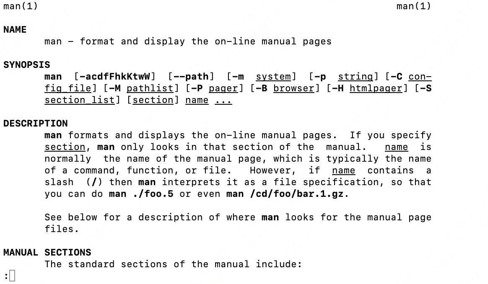

### 有问题，找“男人”

最开始了解`man`记得看的还是《鸟哥的Linux私房菜》。

几乎所有的 shell 命令，都可以用`man` 查看其用法。今天有空，来复习下。

### 语法

```
man  [-acdfFhkKtwW]  [--path]  [-m  system]  [-p  string] [-C con-
       fig_file] [-M pathlist] [-P pager] [-B browser] [-H htmlpager] [-S
       section_list] [section] name ...
```

### 命令解释
- name 命令含义，一般是几个单词的缩写
- synopsis 语法简介，一般`[]`代表可选,`...`代表可0或多次重复

例如：`lua [ options ] [ script [ args ] ]`
- DESCRIPTION 详细使用描述
- OPTIONS 选项描述

### 手册类型
使用语法`man [section] name`，可以显示以下类型的内容：

    1      User Commands    用户命令

    2      System Calls     系统调用

    3      C Library Functions      C函数

    4      Devices and Special Files    设备文件

    5      File Formats and Conventions     文件格式和公约

    6      Games et. Al.    游戏

    7      Miscellanea      杂项

    8      System Administration tools and Deamons      系统管理工具和守护进程

左上角显示是哪种手册类型：



### 保存文档到本地
```
man foo | col -b > foo.mantxt
```